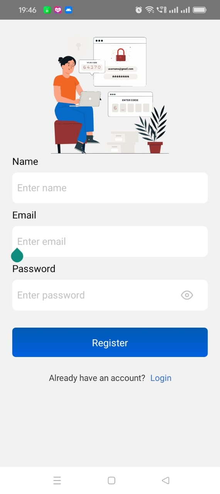
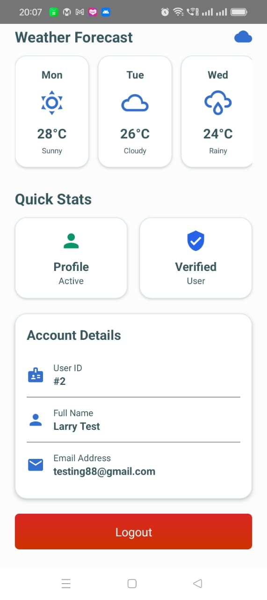

# React Native SQLite Auth

A modern, production-ready React Native authentication system with local SQLite database storage, Redux state management, and beautiful UI components.

## 📱 Features

- **🔐 Complete Authentication System**

  - User Registration & Login
  - Persistent sessions with SQLite
  - Auto-login across app restarts
  - Secure logout with session clearing

- **💾 Local First Architecture**

  - SQLite database for offline functionality
  - AsyncStorage for token persistence
  - Redux Persist for state hydration

- **🎨 Beautiful UI/UX**

  - Custom form components with validation
  - Lottie animations for enhanced UX
  - Responsive design with Tailwind CSS
  - Gradient buttons and cards

- **📊 State Management**
  - Redux Toolkit for predictable state
  - RTK Query for API integration
  - Type-safe actions and reducers

## 🛠 Tech Stack

### **Core Dependencies**

- **React Native 0.73.2** - Mobile framework
- **React 18.2.0** - UI library
- **TypeScript** - Type safety

### **UI & Styling**

- **@rneui/themed** - UI component library
- **tailwind-rn** - Utility-first styling
- **lottie-react-native** - Smooth animations
- **react-native-vector-icons** - Icon library
- **react-native-linear-gradient** - Gradient backgrounds

### **State & Data**

- **Redux Toolkit** - State management
- **Redux Persist** - State persistence
- **React Redux** - React bindings
- **react-native-sqlite-storage** - Local database
- **@react-native-async-storage/async-storage** - Secure storage

### **Navigation**

- **@react-navigation/native** - Navigation core
- **@react-navigation/native-stack** - Stack navigation
- **react-native-screens** - Native screens
- **react-native-safe-area-context** - Safe area handling

### **Networking**

- **axios** - HTTP client
- **react-native-fast-image** - Optimized images

### **Development Tools**

- **@types packages** - TypeScript definitions
- **babel-plugin-module-resolver** - Path aliases
- **prettier & eslint** - Code formatting

## 🚀 Getting Started

### **Prerequisites**

- Node.js >= 18
- npm or yarn
- iOS: Xcode >= 14
- Android: Android Studio & JDK 17

### **Installation**

1. **Clone the repository**

```bash
git clone <repository-url>
cd ReactNativeSQLiteAuth
```

2. **Install dependencies**

```bash
npm install
# or
yarn install
```

3. **Install iOS dependencies**

```bash
cd ios && pod install && cd ..
```

4. **Setup environment (optional)**

```bash
cp .env.example .env
```

### **Running the App**

**iOS**

```bash
npm run ios
# or
npx react-native run-ios
```

**Android**

```bash
npm run android
# or
npx react-native run-android
```

**Development Server**

```bash
npm start
# or
npx react-native start
```

<div style="display: flex; flex-wrap: wrap; gap: 10px;">
  
  
  
  
</div>

<!-- Video Demo -->
<div style="text-align: center; margin: 30px 0;">
  <h3>🎥 App Demo</h3>
  
  <!-- Direct video embed -->
  <video width="540" height="540" controls style="border-radius: 10px; box-shadow: 0 4px 12px rgba(0,0,0,0.1);">
    <source src="./video/demo_video.mp4" type="video/mp4">
    Your browser does not support the video tag.
  </video>
  <p><small>Watch the app in action - Authentication flow demo</small></p>
</div>


## 📁 Project Structure

```
src/
├── components/           # Reusable UI components
│   ├── responsive-ui/   # Responsive UI utilities
│   ├── wrappers-component/ # Container components
│   └── home/            # Home screen components
├── screens/             # Screen components
│   ├── LoginScreen.tsx
│   ├── RegisterScreen.tsx
│   └── HomeScreen.tsx
├── store/               # Redux store
│   ├── slices/          # Redux slices
│   │   └── auth-slice.ts
│   ├── hooks.ts         # Redux hooks
│   └── index.ts         # Store configuration
├── services/            # Services layer
│   ├── database/        # SQLite database service
│   ├── auth/            # Authentication service
│   └── api/             # API service
├── utils/               # Utility functions
├── enums/               # TypeScript enums
├── models/              # Data models
└── typings/             # TypeScript interfaces
```

## 🔧 Key Features Implementation

### **Authentication Flow**

```typescript
// Registration
1. User submits registration form
2. Data validated locally
3. User created in SQLite database
4. Session token generated
5. User data stored in AsyncStorage
6. Redux state updated
7. Navigation to home screen

// Login
1. User submits credentials
2. SQLite validates email/password
3. New session token generated
4. User data persisted
5. Auto-login enabled
```

### **Database Schema**

```sql
CREATE TABLE Users (
  id INTEGER PRIMARY KEY AUTOINCREMENT,
  name TEXT NOT NULL,
  email TEXT UNIQUE NOT NULL,
  password TEXT NOT NULL,
  created_at DATETIME DEFAULT CURRENT_TIMESTAMP
);
```

## 🎨 UI Components

### **Custom TextInput Component**

- Real-time validation
- Password visibility toggle
- Error state handling
- Platform-specific styling

### **Responsive UI System**

- Adaptive font sizes
- Responsive spacing
- Device-specific layouts
- Theme support

### **Lottie Animations**

- Login/Register animations
- Loading states
- Success/error indicators

## 📱 Platform Support

### **iOS**

- SQLite location: `Library` directory
- Safe area handling
- iOS-specific gestures

### **Android**

- SQLite location: `default` directory
- Back button handling
- Material Design compliance

## 🔐 Security Features

- **SQLite encryption**: Secure local storage
- **Input validation**: Client-side validation
- **Error handling**: Graceful error recovery
- **Clean logout**: Complete session cleanup

## 📊 Performance Optimizations

- **SQLite connection pooling**: Reusable database connections
- **Redux memoization**: Prevent unnecessary re-renders
- **Lottie caching**: Optimized animation performance
- **Image optimization**: Fast image loading
- **Code splitting**: Reduced bundle size

## 🧪 Testing

### **Run Tests**

```bash
npm test
# or
yarn test
```

## 🔧 Scripts

| Command                  | Description             |
| ------------------------ | ----------------------- |
| `npm start`              | Start Metro bundler     |
| `npm run ios`            | Run on iOS simulator    |
| `npm run android`        | Run on Android emulator |
| `npm test`               | Run test suite          |
| `npm run lint`           | Run ESLint              |
| `npm run build:tailwind` | Build Tailwind CSS      |
| `npm run dev:tailwind`   | Watch Tailwind changes  |

## 📦 Dependencies Details

### **Main Dependencies**

- **react-native-sqlite-storage**: SQLite database with promise support
- **redux-persist**: Persist and rehydrate Redux store
- **@rneui/themed**: Customizable UI components
- **tailwind-rn**: Tailwind CSS for React Native
- **axios**: Promise-based HTTP client

### **Development Dependencies**

- **TypeScript 5.0.4**: Type safety and better DX
- **@react-native/typescript-config**: TypeScript config
- **prettier**: Code formatting
- **eslint**: Code linting
- **jest**: Testing framework

### **Version Updates**

```bash
# Update all dependencies
npm update

# Update specific package
npm update react-native

# Check for outdated packages
npm outdated
```

### **Database Migrations**

```typescript
// Add migration scripts for schema changes
export const migrateDatabase = async (oldVersion: number, newVersion: number) => {
  // Migration logic here
};
```

## 🤝 Contributing

1. Fork the repository
2. Create a feature branch
3. Commit changes
4. Push to the branch
5. Create a Pull Request

## 📄 License

This project is licensed under the MIT License - see the LICENSE file for details.

## 🙏 Acknowledgments

- React Native team for the amazing framework
- Redux Toolkit team for simplified state management
- SQLite team for reliable local storage
- All open-source contributors

## 📞 Support

For support, email [your-email] or create an issue in the repository.

---

**Built with ❤️ using React Native**
